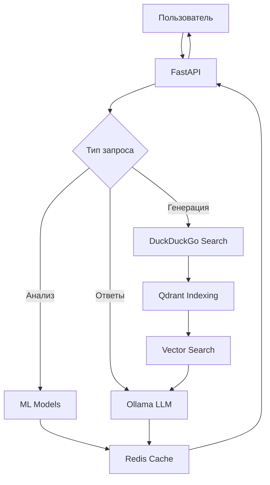

# 🤖 Postic ML - AI-Powered Social Media Management API

<div align="center">

[](https://python.org)
[](https://fastapi.tiangolo.com)
[](https://duckduckgo.com)
[](LICENSE)

**Мощный API для автоматизации управления контентом в социальных сетях с использованием искусственного интеллекта**

[Особенности](#-особенности) • [Установка](#-установка) • [Развертывание](DEPLOYMENT.md) • [API Документация](#-api-документация) • [Примеры](#-примеры) • [Архитектура](#-архитектура)

</div>

---

## 🚀 Особенности

### 🧠 **Искусственный интеллект**
- **LLM интеграция** с Ollama для генерации контента
- **Анализ тональности** комментариев в реальном времени  
- **Автоматическая классификация** обращений в поддержку
- **Интеллектуальная генерация ответов** на комментарии

### 🔍 **Умный поиск**
- **DuckDuckGo интеграция** без ограничений API
- **Векторный поиск** с Qdrant для семантического анализа
- **Автоматическая индексация** найденного контента
- **Фильтрация по доменам** и черным спискам

### ⚡ **Производительность**
- **Асинхронная архитектура** на FastAPI
- **Redis кеширование** для быстрого доступа к данным
- **Векторные эмбеддинги** для эффективного поиска
- **Batch обработка** множественных запросов

### 🔧 **Модульность**
- **Чистая архитектура** с разделением на слои
- **Независимые сервисы** для легкого тестирования
- **Конфигурируемые компоненты** через переменные окружения
- **Расширяемый дизайн** для добавления новых функций

---

## 📦 Установка

### Требования
- Python 3.12.10+
- Redis Server
- Qdrant Vector Database
- Ollama с подключенными моделями

### Быстрый старт

#### 🐳 Локальная разработка
```bash
# Клонирование репозитория
git clone <repository-url>
cd postic-ml

# Установка зависимостей
pip install -r requirements.txt

# Настройка переменных окружения
cp example.env .env
# Отредактируйте .env файл под ваши настройки

# Запуск сервера
python main.py
```

#### ☸️ Развертывание в Kubernetes

Для полной инструкции по развертыванию смотрите **[DEPLOYMENT.md](DEPLOYMENT.md)**

**Быстрое развертывание в Minikube:**
```powershell
# Запуск Minikube с GPU поддержкой
minikube start --driver=docker --gpus=all --memory=8192 --cpus=4

# Включение дополнений
minikube addons enable ingress
minikube addons enable metrics-server

# Развертывание приложения
kubectl apply -k k8s/overlays/minikube/

# Получение URL для доступа
minikube service postic-ml-service -n postic-ml --url
chmod +x cleanup-minikube.sh
./cleanup-minikube.sh
```

**Доступ к приложению:**
- 🌐 API: http://{minikube-ip}:30080
- 📖 Документация: http://{minikube-ip}:30080/docs
- 📊 Dashboard: `minikube dashboard`

**Мониторинг:**
```bash
# Статус подов
kubectl get pods -n postic-ml

# Логи приложения
kubectl logs -f deployment/postic-ml-app -n postic-ml

# Логи Ollama
kubectl logs -f deployment/ollama -n postic-ml

# Использование ресурсов
kubectl top pods -n postic-ml
```

### Docker запуск (legacy - удален)
Старые Docker Compose файлы были удалены. Используйте Kubernetes для развертывания.

---

## 🔌 API Документация

### Base URL: `http://localhost:8000`

<details>
<summary><strong>📝 Генерация контента</strong></summary>

#### `GET /publication`
Генерирует пост для социальных сетей на основе поискового запроса

**Request:**
```json
{
  "query": "составь пост про здоровое питание"
}
```

**Response:**
```json
{
  "text": "Решил поделиться своим опытом здорового питания...",
  "images": [
    "https://example.com/image1.jpg",
    "https://example.com/image2.jpg"
  ]
}
```

**Особенности:**
- 🔍 Автоматический поиск релевантной информации
- 📝 Генерация текста от первого лица
- 🖼️ Подбор соответствующих изображений
- 💾 Кеширование результатов

</details>

<details>
<summary><strong>💬 Анализ комментариев</strong></summary>

#### `GET /sentiment`
Анализирует тональность комментария

**Request:**
```json
{
  "comment": "Отличный продукт, очень доволен!"
}
```

**Response:**
```json
{
  "label": "POSITIVE",
  "score": 0.9803528785705566
}
```

#### `GET /ans`
Генерирует ответы на комментарии с определением типа реакции

**Request:**
```json
{
  "comment": "Как подключить наушники к телефону?",
  "style": "дружелюбном"
}
```

**Response:**
```json
{
  "no_answer": false,
  "support_needed": false,
  "answer_0": "Подключение очень простое! Включите Bluetooth...",
  "answer_1": "Для подключения зайдите в настройки...",
  "answer_2": "Попробуйте следующие шаги..."
}
```

**Специальные случаи:**
- `no_answer: true` - спам/оскорбления (не отвечать)
- `support_needed: true` - требуется техподдержка

</details>

<details>
<summary><strong>🎫 Классификация обращений</strong></summary>

#### `GET /ticket_synt`
ML-классификация необходимости создания тикета поддержки

**Request:**
```json
{
  "comment": "Не могу войти в аккаунт, помогите!"
}
```

**Response:**
```json
{
  "support_needed": true
}
```

#### `GET /ticket_llm`
LLM-классификация обращений в поддержку

**Request:**
```json
{
  "comment": "У меня проблема с оплатой"
}
```

**Response:**
```json
{
  "support_needed": true
}
```

**Различия подходов:**
- **ticket_synt**: Быстрая ML-модель, обученная на данных
- **ticket_llm**: LLM анализ, более точный но медленный

</details>

<details>
<summary><strong>📊 Обработка текста</strong></summary>

#### `GET /sum`
Суммаризация множественных комментариев

**Request:**
```json
{
  "comments": [
    "Отличный товар, рекомендую!",
    "Быстрая доставка, все понравилось",
    "Качество на высоте, буду заказывать еще"
  ]
}
```

**Response:**
```json
{
  "response": "### Краткое содержание комментариев:\nПользователи высоко оценивают качество товара и скорость доставки..."
}
```

#### `GET /fix`
Исправление орфографических и пунктуационных ошибок

**Request:**
```json
{
  "text": "Привет! Как дила? Очинь интиресно узнать."
}
```

**Response:**
```json
{
  "response": "Привет! Как дела? Очень интересно узнать."
}
```

</details>

---

## 📈 Примеры использования

### Python клиент
```python
import httpx
import asyncio

async def generate_post():
    async with httpx.AsyncClient() as client:
        response = await client.get(
            "http://localhost:8000/publication",
            json={"query": "польза йоги для здоровья"}
        )
        return response.json()

# Запуск
result = asyncio.run(generate_post())
print(result["text"])
```

### cURL примеры
```bash
# Генерация поста
curl -X GET "http://localhost:8000/publication" \
  -H "Content-Type: application/json" \
  -d '{"query": "рецепт борща"}'

# Анализ тональности
curl -X GET "http://localhost:8000/sentiment" \
  -H "Content-Type: application/json" \
  -d '{"comment": "Супер качество!"}'
```

### JavaScript/Node.js
```javascript
const response = await fetch('http://localhost:8000/ans', {
  method: 'GET',
  headers: {'Content-Type': 'application/json'},
  body: JSON.stringify({
    comment: 'Как вернуть товар?',
    style: 'вежливом'
  })
});

const data = await response.json();
console.log(data.answer_0);
```

---

## 🏗️ Архитектура

### Структура проекта
```
postic-ml/
├── 📁 api/                    # API эндпоинты
│   ├── comments.py           # Обработка комментариев
│   └── publication.py        # Генерация публикаций
├── 📁 config/                # Конфигурация
│   └── settings.py          # Настройки приложения
├── 📁 core/                  # Инициализация
│   └── init.py              # Подключение сервисов
├── 📁 models/                # Модели данных
│   ├── chunk.py             # Текстовые блоки
│   └── classifier.py        # ML классификаторы
├── 📁 services/              # Бизнес-логика
│   ├── duckduckgo_search.py # Поисковый сервис
│   ├── embedding_service.py # Векторные представления
│   ├── llm_service.py       # LLM интеграция
│   └── search_service.py    # Индексация и поиск
├── 📁 utils/                 # Утилиты
│   └── text_processing.py   # Обработка текста
└── main.py                  # Точка входа
```

### Технологический стек

| Компонент | Технология | Назначение |
|-----------|------------|------------|
| **API Framework** | FastAPI | Веб-сервер и REST API |
| **ML Backend** | Ollama | LLM модели для генерации |
| **Vector DB** | Qdrant | Векторный поиск и хранение |
| **Cache** | Redis | Кеширование результатов |
| **Search** | DuckDuckGo | Веб-поиск без ограничений |
| **ML Models** | PyTorch, Transformers | Классификация и эмбеддинги |
| **HTTP Client** | httpx | Асинхронные HTTP запросы |

### Потоки данных



---

## ⚙️ Конфигурация

### Переменные окружения

```bash
# Сервер
HOST=127.0.0.1
PORT=8000

# Qdrant
QDRANT_HOST=127.0.0.1
QDRANT_PORT=6333

# Redis
REDIS_HOST=127.0.0.1
REDIS_PORT=6379

# Ollama
OLLAMA_HOST=http://localhost:11434
OLLAMA_MODEL=gemma3:4b
OLLAMA_EMBEDDING_MODEL=bge-m3:567m
OLLAMA_TIMEOUT=60

# Поиск
REFERENCE_COUNT=10
DEFAULT_TIMEOUT=5
```

### Настройка моделей

1. **Установите Ollama**:
   ```bash
   # Linux/macOS
   curl -fsSL https://ollama.ai/install.sh | sh
   
   # Windows
   # Скачайте с https://ollama.ai
   ```

2. **Загрузите модели**:
   ```bash
   ollama pull gemma3:4b
   ollama pull bge-m3:567m
   ```

3. **Проверьте работу**:
   ```bash
   ollama list
   ```

---

## 🧪 Тестирование

### Запуск тестов
```bash
# Быстрый тест DuckDuckGo
python test_duckduckgo_minimal.py

# Тест производительности
---

## 📚 Документация

- **[🚀 Развертывание](DEPLOYMENT.md)** - Полное руководство по развертыванию в Kubernetes и Minikube
- **[⚡ Быстрые команды](QUICK_COMMANDS.md)** - Справочник команд для ежедневной работы
- **[🏗️ Структура проекта](STRUCTURE.md)** - Архитектура и организация кода
- **[☸️ Kubernetes структура](K8S_STRUCTURE.md)** - Организация k8s конфигураций
- **[📦 Registry](REGISTRY.md)** - Настройка GitHub Container Registry
- **[🧪 Тесты](tests/README.md)** - Руководство по тестированию

---

<div align="center">

**⭐ Поставьте звезду, если проект был полезен!**

Сделано с ❤️ в рамках VK Education для проекта Postic  
Киберкотлетки - сила 💪

</div>